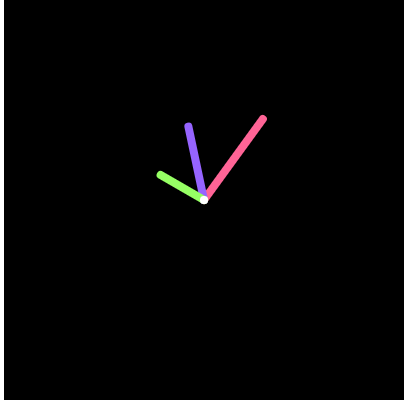

### This Clock uses a P5.js library to draw on a canvas.

### Here's a example of the clock from this project.

### Demo Link: https://shreekrishnalamichhane.github.io/Classic-Clock-With-HTML-and-CSS/

### I believe in opensource . 
So any pull requests with the bug fixing and new feature will be appreciated. Thanks.
